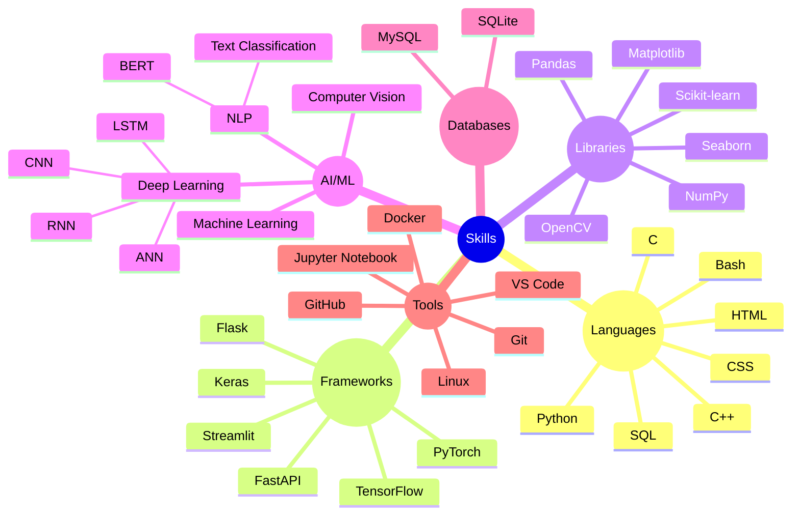

<!-- <picture>
  <source media="(prefers-color-scheme: dark)" srcset="https://github.com/hyprex-deva/Portfolio/blob/main/Screenshot%202022-08-30%20202715.jpg?raw=true">
  <source media="(prefers-color-scheme: light)" srcset="https://github.com/hyprex-deva/Portfolio/blob/main/Screenshot%202022-08-30%20202715.jpg?raw=true">
  
</picture> -->

<!-- 

  <h3>👋 Hi, I’m a coder exploring the world of Data Science and Machine Learning.</h3>

💻I spend my free time coding, experimenting with projects, and occasionally gaming💻  
🌱I’m a dedicated and fast learner, always curious to understand how things work and improve my skills🌱  
   
 

 -->

👋 Hi, I'm a Computer Science student and aspiring AI/ML Engineer. 👋

🔬 Co-author of 4 IEEE-published research papers in Machine Learning and Natural Language Processing. 🔬

💻 Hands on with Python, Machine Learning, Deep Learning, and backend development. 💻

🚀 Passionate about building impactful projects and applying research to real-world problems. 🚀

📖 Always learning, experimenting, and improving. 📖

<h2 align="center">Connect with me:</h2>

<!--  -->
  <!--  -->
<!--    -->

 
 
 
 
 
 
 

<h2 align="center">Knowledge Areas</h2>

<h2 align="center">Research Publications</h2>

Co-author of 4 IEEE-published research papers focusing on Machine Learning, Deep Learning, Natural Language Processing, and Data Science.

### IEEE Publications

1. [Multilingual SMS Spam Detection using BERT and LSTM](https://ieeexplore.ieee.org/abstract/document/10616322)
2. [Language Detection Using Machine Learning](https://ieeexplore.ieee.org/abstract/document/10430539)
3. [Leveraging BERT-Enhanced MLP Classifier for Automated Stress Detection in Social Media Articles](https://ieeexplore.ieee.org/abstract/document/10743857)
4. [Investigating deep learning architectures for robust speech emotion recognition: A study of lstm, cnn, and clstm model](https://ieeexplore.ieee.org/abstract/document/10837169)

**Research Areas:** NLP • Deep Learning • Machine Learning • Data Science

<!-- <h2 align="center">Languages and Tools:</h2>

           
 -->

<!--

          

  -->

<h2 align="center">Activity</h2>
<!-- 

)

&nbsp;

  

  
<!-- 

 

 -->

  

 

                                                                          

